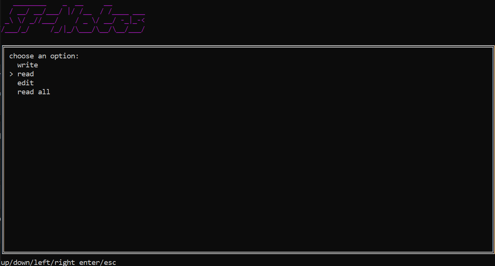

# sf-notes

### setup
edit line 2 with the folder where all the notes are saved. this isnt really meant for other people to use to its a bad way of doing it i know.

make a folder in the base folder to create a new "project" of sorts.

